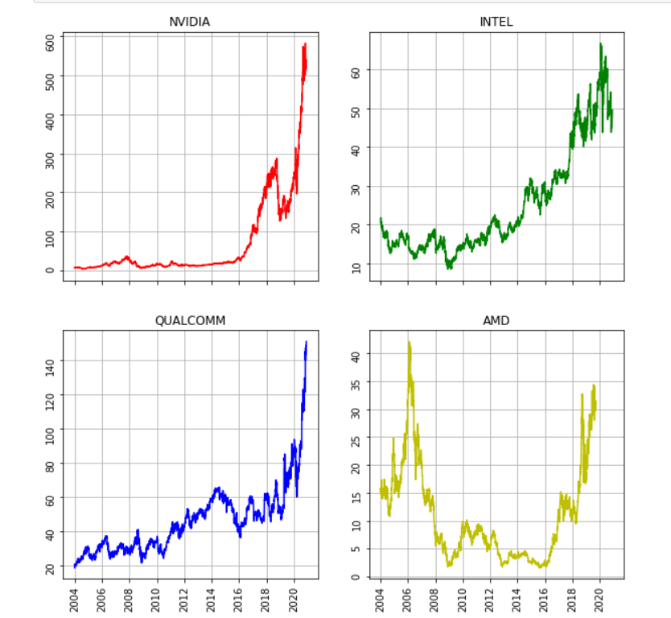
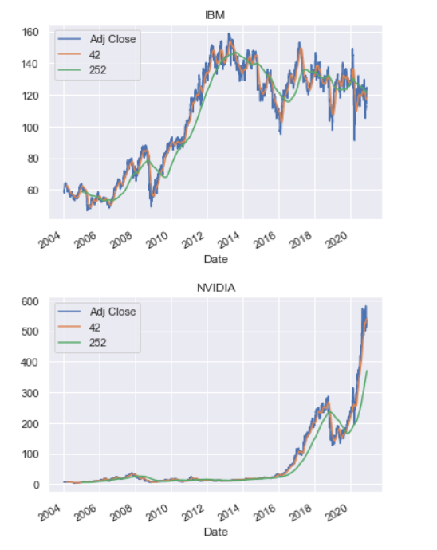
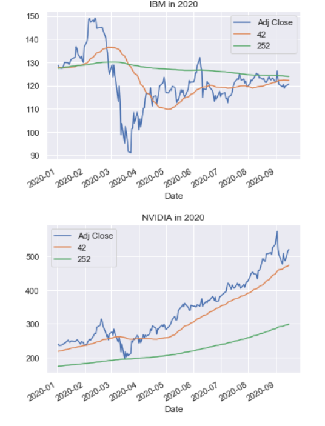

# Stock-Market-Analysis

# Main purpose of this Analysis:
1. Understand the volatilty of AMD,Intel,Nvidia,IBM and Qualcomm stock prices
2. Gain insight into Financial analysis using Python
3. Improve Python coding skills

# Steps done int this project:
1. Importing Datasets / Collecting Data
2. Resampling Data
3. Sneak Peek into Moving Averages
4. Analysing Volatility of Stocks

# Time Series Graph:

# Quarterly Resampling:

.png)

# Weekly Resampling:
.png)

# Volatility of IBM and NVidia Stocks for 2014-2020:

# Volatility of IBM and NVidia Stocks in 2020:

